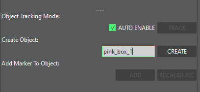

# Making Objects in Vicon Tracker
A step-by-step walkthrough for how to create an object in Vicon Tracker.

#### Step 1

Prepare your object by determining the reference point (centerpoint) along two dimensions. For our object, the “cross” in the middle is centered along the width and height.

#### Step 2

Attach a marker on top of the reference point. This is our **reference marker**.

#### Step 3

Attach more markers in some unique arrangement. If the arrangement is very similar to another object, the tracker may confuse the object it is looking at, so try to make sure the arrangement is someone unique to each object. Make sure at least one marker is 180 degrees about the vertical axis from the reference marker. We will call this the **secondary reference marker**. 

Generally, 6 markers per object will give good results for finding the object. You may try fewer, however you may find blind spots/orientations that the tracker loses sight of the object, or the orientation may be glitchy.
#### Step 4

Open Vicon Tracker, and remove any unnecessary markers from the environment (you should see two markers on either side of Franka, disregard those). In the “Objects” pane, make sure all objects are unchecked, so that the visible markers show up as white dots. Align your object with one of the global coordinate axes and make sure you can see all markers on your object.

#### Step 5

Select all of the markers on your object using “ctrl + left click”.

#### Step 6

In the lower left, name and “create” your object. Using the VRPN client with ROS, the topic will be named according to the name you provide in this field.

After creating the object, you should see something like this, with a gray cube and local frame axes.

#### Step 7

Make sure your object is checked, then pause the tracker using the small green pause button shown.

#### Step 8

We now have to align the local frame of the object to something that is interpretable, in this case the **reference marker**. Select the **reference marker** in Vicon Tracker, as shown. Click and drag the colored coordinate axes until they “snap” into alignment with the selected marker. For this example, our **reference marker** was placed at the center point along the width and height axes, so we will center the red and blue coordinate axes. Don’t worry about the green one yet.

#### Step 9

Finally, to align the remaining axis, select both the reference marker and the **secondary reference marker**. Tracker will automatically create a fake “centroid” point (dark gray sphere). In this case, the centroid is the midpoint between our **reference** and **secondary reference** (180 degrees about the center). Drag the remaining green axis so that the local origin snaps to the centroid marker.

Amazing! At this point, the local frame is translationally aligned with the center of our object. Additionally, the orientation is default aligned to however the object was initially placed.

Unpause tracker and you are good to go!

