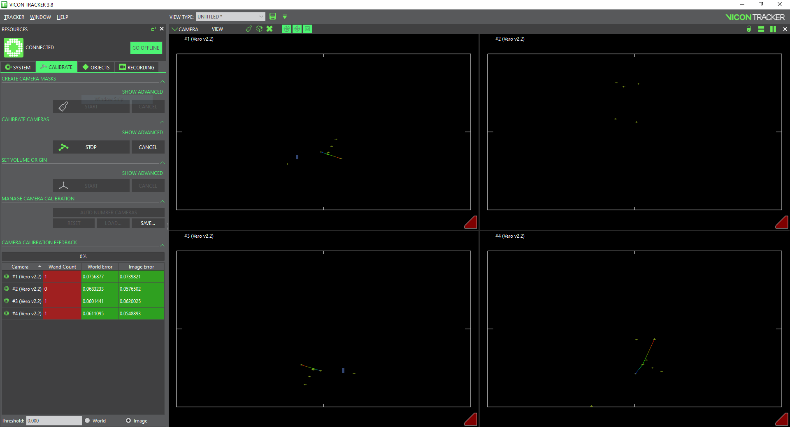
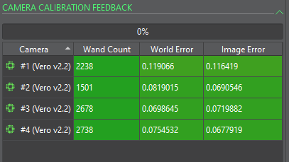
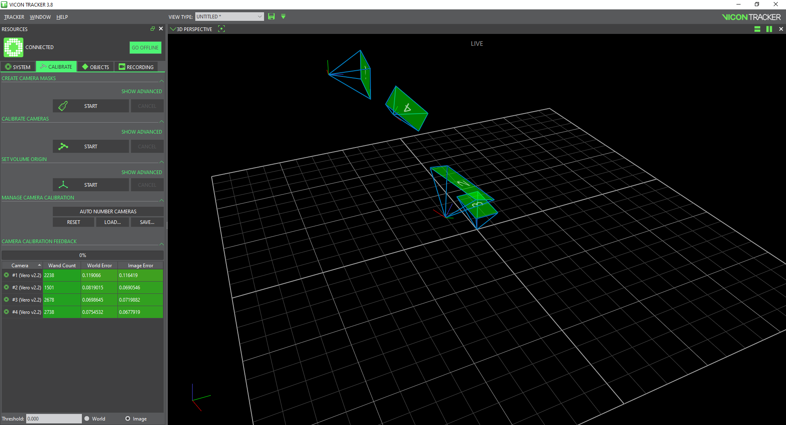
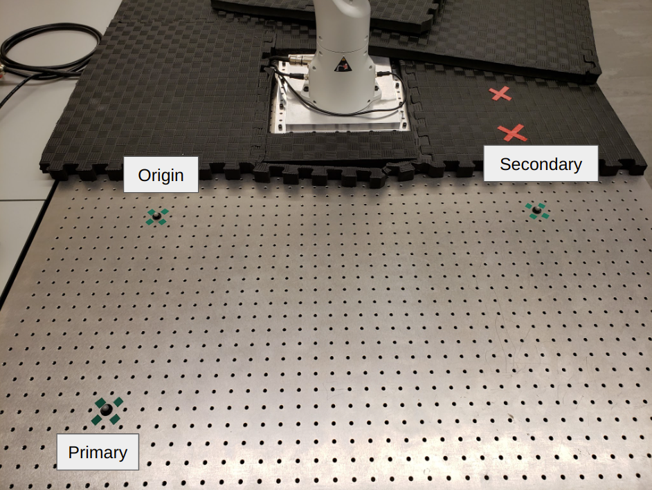

# Calibrating the Vicon System to Franka
A step-by-step walkthrough for how to calibrate the vicon system in ARIA lab and match to the Franka Panda frame.

#### Step 1

Turn on the Active Wand (blue box) and make sure the red LED's light up. If not, the wand may need to be charged. Start Vicon Tracker and navigate to the `CALIBRATE` tab.

Start `CALIBRATE CAMERAS`. Wave the wand around the space around Franka, you will notice the boxes in the `CAMERA CALIBRATION FEEDBACK` pane gradually turn to green. Tracker will automatically finish calibrating once enough data has been collected, as shown below.

#### Step 2

Once this process is complete, if you return to the 3D view in Tracker, you will see that the Vicon frame does not match the real world frame (shown below).

We now need to match the coordinate system to Franka's frame. Start by removing the two foam panes in front of Franka. You should see three spots marked with green tape on the metal face of the table. Place a 9.5mm marker precisely over the center hole marked by the green tape for all three spots, as shown.

#### Step 3

Under `SET VOLUME ORIGIN` select `Three Markers`. 

If you placed the three markers exactly in the green tape regions, make sure the offset box is and the offset is `x: 340.00mm`, `y: 368.30mm`, `z: 28.00mm`. First select the `Origin` marker (labeled in step 2), then the `Primary` marker, and finally the `Secondary` marker. The markers will snap to the correct relative position. Verify that the frame position is roughly what you expect, and you are good to go!

